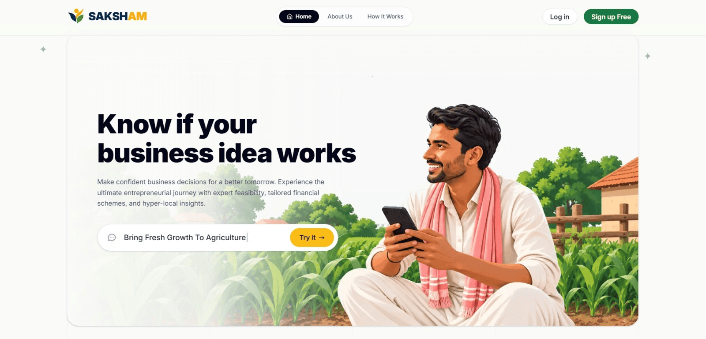
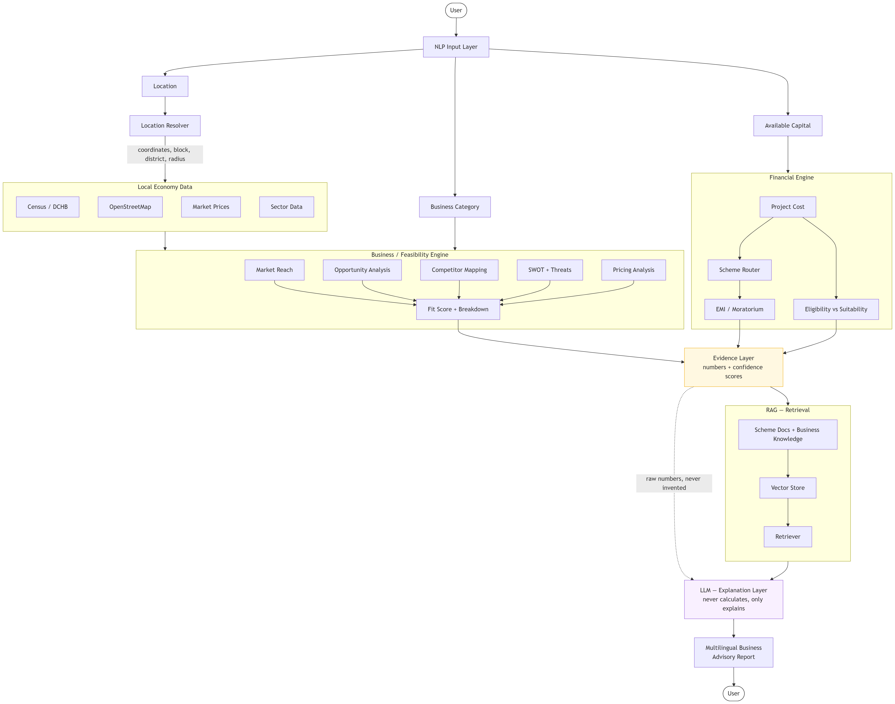
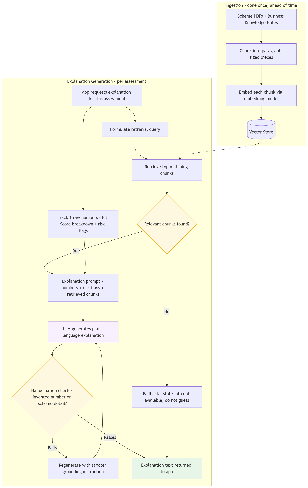
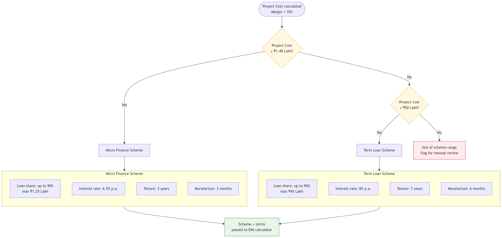
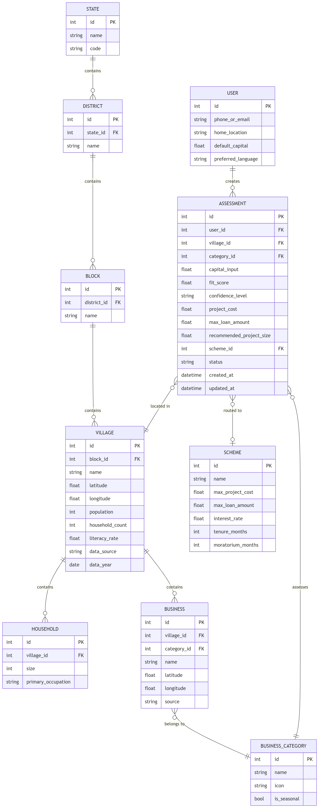
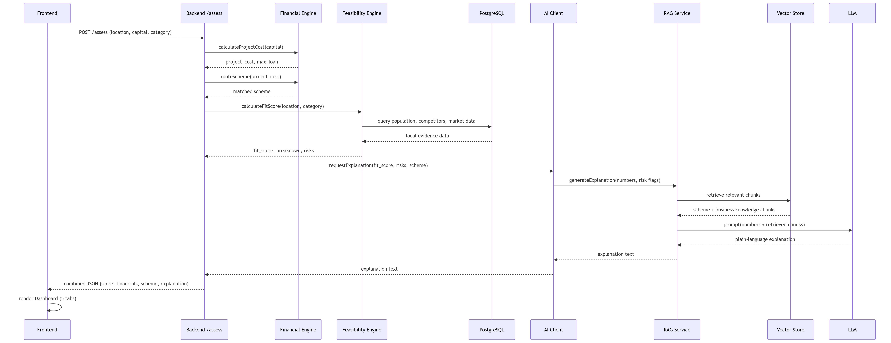
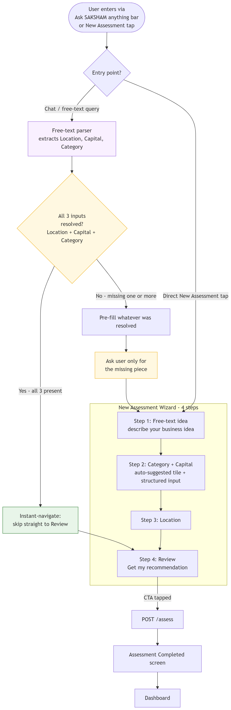

<div align="center">


**AI-Driven Hyper-Local Business Advisory & Financial Structuring Assistant for Rural Micro-Entrepreneurs**

[](backend)
[](frontend)
[](ai)
[](#-testing--quality-gates)
[](RULES.md)
[](#-current-status--roadmap)

[Problem](#-the-problem) · [What we built](#-what-saksham-is) · [Why SAKSHAM](#-why-saksham) · [Architecture](#-system-architecture) · [Product Walkthrough](#-product-walkthrough) · [Tech Stack](#-tech-stack) · [Getting Started](#-getting-started) · [API](#-api-overview) · [Quality](#-testing--quality-gates) · [Roadmap](#-current-status--roadmap)

</div>

<p align="center">
  
</p>

---

## 🧭 The Problem

Government schemes make concessional credit available for rural income-generating activities: the beneficiary puts in **~10% margin money**, and a State/Central Channelizing Agency funds the remaining 90%. The capital exists. What's missing is the *decision layer*: first-time rural entrepreneurs rarely have localized market research or the financial literacy to translate "I have ₹1,00,000" into "this is the business to start, this is the loan you qualify for, and this is what your EMI will look like."

**SIH Problem Statement #91** asks for exactly that decision layer, built on two real government financing schemes:

| | Micro Finance Scheme | Term Loan Scheme |
|---|---|---|
| Project cost range | Up to ₹1.40 lakh | ₹1.40 lakh to ₹50 lakh |
| Loan share | Up to 90% (max ₹1.25 lakh) | Up to 90% (max ₹45 lakh) |
| Interest rate | 6.5% p.a. | 8% p.a. |
| Tenure | 3 years | 7 years |
| Moratorium | 3 months | 6 months |

```
Project Cost = Available Margin Capital ÷ 10%
Max Loan     = 90% of Project Cost (capped at scheme ceiling)
Scheme       = Micro Finance (≤ ₹1.40L)  or  Term Loan (₹1.40L to ₹50L)
```

Given three inputs (**Location, Available Margin Capital, and Business Category**), the brief asks for two deliverables: a **Hyper-Local Business Feasibility Report** (market reach, opportunity, SWOT, competitor mapping) and a **Smart Financial Calculator & Scheme Router** (project structuring, scheme auto-selection, EMI/moratorium).

## 💡 What SAKSHAM Is

SAKSHAM is a **decision-support system**, not a chatbot and not a loan-approval engine. It takes those three inputs and produces a full advisory report: whether the business makes sense *at that location*, how it should be financed, and which scheme it routes to, with every number traceable back to a deterministic formula or a cited source document, never an LLM guess.

**Guiding architectural rule, enforced end to end:**

```
DATA PROVIDES EVIDENCE  ->  DETERMINISTIC ENGINES CALCULATE  ->  AI EXPLAINS
```

An LLM is never allowed to compute loan eligibility, decide scheme thresholds, or invent a competitor count or market price. Those come from real formulas and real data (Census, OpenStreetMap, curated scheme documents). The language layer's job is retrieval-grounded explanation, multilingual interaction, and turning structured output into something a first-time entrepreneur can actually read.

| SAKSHAM is | SAKSHAM is *not* |
|---|---|
| A hyper-local feasibility + financial structuring advisor | A loan approval system (the bank/SCA still decides) |
| A decision-support tool with a Business Fit Score | A guaranteed business-success predictor |
| Grounded in cited government scheme text and real geo data | A generic chatbot that answers from its own memory |
| Explicit about data recency and confidence | A government portal replacing official application systems |

### Eligibility vs. Suitability
SAKSHAM deliberately separates two numbers that get conflated everywhere else:
- **Eligibility**: the maximum you could theoretically finance.
- **Suitability**: the amount actually recommended for *this* business, at *this* location, with *this* capital.

### Evidence honesty, by design
Every figure that isn't a live computation is labeled with its provenance and age, e.g. Census 2011 demographic baselines are shown as *baselines*, not "current population." Template/illustrative project figures (from the sample dairy-plant project report) are flagged `is_template_data = true` all the way through the pipeline so they're never presented as local facts. This isn't a cosmetic disclaimer: it's enforced in the retrieval and grounding code (see [`ai/grounding`](ai/grounding) and [`ai/prompts/explanation_prompt.py`](ai/prompts/explanation_prompt.py)).

## 🥇 Why SAKSHAM

Rural entrepreneurs today are choosing between a handful of options, and each one is missing something SAKSHAM was built specifically to cover:

| Capability | **SAKSHAM** | Generic loan-comparison aggregators | General-purpose AI chatbot | Government scheme portals | Human bank / CA consultant |
|---|:---:|:---:|:---:|:---:|:---:|
| Feasibility scored for your *exact* village, not just your city | ✅ Census + OSM per query | ❌ | ⚠️ Only if you feed it the data yourself | ❌ | ✅ but not scalable |
| Financial math (project cost, EMI, scheme routing) runs on fixed formulas, not model guesses | ✅ | ⚠️ EMI only, no feasibility layer | ❌ Can miscalculate or invent figures | ❌ No calculator | ✅ but manual, inconsistent |
| Every advisory claim traces back to a cited source document | ✅ Citation IDs validated against real evidence | ❌ | ❌ No citations | ⚠️ Static document only | Depends on the individual |
| Shows Eligibility (maximum) *and* Suitability (recommended) as separate numbers | ✅ | ❌ Usually only the maximum | ❌ | ❌ | ⚠️ Sometimes |
| Multilingual (English / Hindi / Hinglish), works on a low-end phone as an installable PWA | ✅ | ⚠️ Rarely, desktop-first | ⚠️ Depends on prompting skill | ⚠️ Rarely | ⚠️ Depends on the local agent |
| Free, no travel, no appointment | ✅ | ✅ | ✅ | ✅ but jargon-heavy navigation | ❌ Cost and access barrier |
| Explicit about stale or illustrative data instead of presenting it as fact | ✅ Confidence + provenance on every figure | ❌ | ❌ | ⚠️ Varies | ⚠️ Varies |

The short version: aggregators calculate but don't localize, chatbots localize but can't be trusted to calculate or cite sources, and portals inform but don't advise. SAKSHAM is built at the intersection: **deterministic finance + grounded local evidence + a language layer that only explains, never invents.**

## 🏗️ System Architecture

```
                         SAKSHAM
                            |
              +-------------+-------------+
       BUSINESS INTELLIGENCE       FINANCIAL INTELLIGENCE
       (Market / Risk / Competition)  (Project / Scheme / Repayment)
              +-------------+-------------+
                            v
                     EVIDENCE LAYER  (numbers + confidence, never invented)
                            v
                    RAG / KNOWLEDGE BASE  (ChromaDB, 4 curated documents)
                            v
                  AI ADVISOR / EXPLANATION LAYER  (grounded, cited, never calculates)
                            v
                   MULTILINGUAL ADVISORY REPORT
                            v
                       USER DECISION
```

<p align="center"></p>

**Request flow:** `Frontend (Next.js)` -> `Main Backend (FastAPI :8000)` -> deterministic **Location / Financial / Feasibility engines + Postgres** -> `AIClient` -> **AI/RAG microservice (FastAPI :8001)**: query parser, ChromaDB retriever, evidence pack, grounded explainer, then a structured response back up the chain. If the AI microservice is unreachable, the assessment **degrades to a deterministic, rule-based explanation** rather than failing or fabricating advice: every assessment always returns real numbers.

<details>
<summary>Additional diagrams (RAG pipeline, scheme routing, ER diagram, API sequence, navigation map)</summary>

| | |
|---|---|
| **RAG Pipeline** |  |
| **Scheme Routing Logic** |  |
| **Database ER Diagram** |  |
| **API Sequence Diagram** |  |
| **New Assessment Flow** |  |
| **Assessment Status Lifecycle** |  |

</details>

### Why RAG instead of a fine-tuned or purely generative model
The knowledge SAKSHAM needs to explain (scheme clauses, project-report figures, district profiles) is static, authoritative, and small: exactly the case where retrieval-plus-citation beats a model trying to "remember" facts. Every explanation traces back to a `chunk_id` and `document_id` that the validator checks against the actual evidence pack before it's ever shown to a user (see [Current Status & Roadmap](#-current-status--roadmap) for what this does and doesn't guarantee today).

## 📱 Product Walkthrough

<table>
<tr>
<td align="center" width="50%">
<br>
<sub><b>Discover</b>: the home screen.</sub>
</td>
<td align="center" width="50%">
<br>
<sub><b>Dashboard</b>: one assessment's full report.</sub>
</td>
</tr>
</table>

> Drop your own screenshots into a `screenshots/` folder at the repo root using the filenames referenced above (`landing-page.png`, `discover.png`, `dashboard.png`), or update the paths/captions to match whatever you add.

## 🧩 Tech Stack

| Layer | Technology |
|---|---|
| **Frontend** | Next.js 16 (Turbopack, App Router), React 19, TypeScript, Tailwind CSS 4, MapLibre GL / react-map-gl (OSM tiles), Vitest + Testing Library |
| **Backend** | FastAPI, SQLAlchemy 2, Alembic migrations, PostgreSQL (Neon) / SQLite (local & tests), Pydantic, JWT auth (`python-jose`, `bcrypt`) |
| **AI / RAG microservice** | FastAPI, ChromaDB (local sentence-transformer embeddings, fully offline), deterministic evidence-grounded explanation layer, `pdfplumber` for source ingestion |
| **Data** | Census / DCHB village demographics, OpenStreetMap competitor mapping, curated PMFME + district + entrepreneurship-manual documents |
| **Quality tooling** | `pytest` + `pytest-cov`, `radon` (complexity/Halstead), `vulture` (dead code), ESLint + `sonarjs`, `tsc --strict`, Vitest coverage |

## 📁 Repository Structure

```
saksham-sih2026/
├── frontend/            Next.js PWA: Discover, New Assessment, Dashboard, Compare, Schemes
├── backend/              FastAPI gateway: auth, assessments, locations, schemes, insights, AI gateway
│   ├── app/engines/      Deterministic financial + feasibility engines
│   ├── app/routers/      REST endpoints
│   ├── app/db/           SQLAlchemy models, queries, Alembic migrations
│   └── tests/
├── ai/                   Standalone AI/RAG microservice
│   ├── ingestion/        PDF extraction, cleaning, chunking (never touches source PDFs)
│   ├── knowledge_base/   4 curated source documents + generated chunks
│   ├── retrieval/        ChromaDB vector store + retriever
│   ├── grounding/        Evidence pack construction, warning/disclaimer enforcement
│   ├── prompts/          Query parser + grounded explanation prompt & validator
│   ├── service/          FastAPI app exposing /query
│   └── tests/
├── docs/                 Master reference, API contracts, data dictionary, work logs
├── diagrams/             Architecture, ERD, sequence, flowchart and UI concept exports
├── RULES.md              Hard code-quality gates (see below)
└── AGENTS.md             Living task/handoff log between build sessions
```

## 🚀 Getting Started

### Prerequisites
- Python 3.11+ and Node.js 20+
- A PostgreSQL database (e.g. [Neon](https://neon.tech)), or just use SQLite locally with no setup needed

### 0. Clone the repository
```bash
git clone https://github.com/<your-org>/saksham-sih2026.git
cd saksham-sih2026
```
> Replace `<your-org>` with wherever this repository actually lives; no remote URL was included in the source archive this README was generated from.

### 1. AI / RAG microservice (port 8001)
```bash
cd ai
pip install -r requirements.txt
python -m ai.ingestion.chunk_documents      # (re)build chunks from cleaned docs, if needed
python -m ai.ingestion.embed_and_store      # build/refresh the ChromaDB vector store
uvicorn ai.service.main:app --reload --port 8001
```

### 2. Backend gateway (port 8000)
```bash
cd backend
pip install -r requirements.txt
cp ../.env.example .env        # fill in DATABASE_URL / JWT_SECRET_KEY, or leave DATABASE_URL unset to use local SQLite
alembic upgrade head            # or: python create_tables.py
uvicorn app.main:app --reload --port 8000
```

### 3. Frontend (port 3000)
```bash
cd frontend
cp .env.example .env.local     # NEXT_PUBLIC_BACKEND_URL=http://localhost:8000
npm install
npm run dev
```

Then open **http://localhost:3000**. If the AI microservice isn't running, assessments still work end to end: the backend gateway falls back to deterministic, rule-based advisory text instead of failing.

### Common frontend commands
```bash
npm run dev             # start the Next.js dev server (Turbopack)
npm run build            # production build
npm run start            # run the production build
npm run lint             # ESLint
npm run test              # run the Vitest suite once
npm run test:watch        # Vitest in watch mode
npm run test:coverage     # Vitest with coverage report
```

### Common backend commands
```bash
uvicorn app.main:app --reload --port 8000    # dev server with hot reload
alembic revision --autogenerate -m "message"  # create a new migration
alembic upgrade head                          # apply migrations
pytest tests/ --cov                            # run backend tests with coverage
python create_tables.py                        # quick local SQLite bootstrap without Alembic
```

## 🔌 API Overview

All routes are served by the backend gateway (`:8000`); the frontend never talks to the AI microservice directly.

| Method | Endpoint | Purpose |
|---|---|---|
| `POST` | `/api/v1/assess` | Run a full assessment (location + capital + category into feasibility + financial structure + AI advisory) |
| `GET` | `/api/v1/assess/{id}` | Fetch a persisted assessment (identical shape to the creation response) |
| `GET` | `/api/v1/assess/history` | List a user's past assessments |
| `GET` | `/api/v1/assess/my-reports` | Assessments grouped for the "My Reports" screen |
| `GET` | `/api/v1/locations?q=` | Live village/block/district search (Census-backed) |
| `POST` | `/api/v1/locations/resolve` | Resolve a free-text location string to a canonical village |
| `GET` | `/api/v1/schemes` | List financing schemes (Micro Finance, Term Loan) |
| `POST` | `/api/v1/schemes/calculate-emi` | Reducing-balance EMI simulator with moratorium |
| `POST` | `/api/v1/schemes/match` | Match project cost to the correct scheme |
| `GET` | `/api/v1/insights/{location}` | Hyper-local demand/category insight indicators |
| `POST` | `/api/v1/ai/query` | Conversational AI advisory gateway (proxies to the AI microservice, never exposed to the browser directly) |
| `POST` | `/api/v1/auth/*` | Registration, login, Google sign-in, profile |

Full request/response contracts, including the exact deterministic formulas below, are documented in [`docs/api-contracts.md`](docs/api-contracts.md).

### The three deterministic formulas everything else is built on

```
Project Cost          = Available Margin Capital ÷ 10%
Maximum Eligible Loan = min(Project Cost × 90%, Scheme Ceiling)

EMI = P × r × (1+r)^n / [(1+r)^n − 1]     where r = annual rate / 12,  n = tenure minus moratorium (months)

Fit Score = (Market × 0.30) + (Competition × 0.25) + (Capital Fit × 0.25) + (Infrastructure × 0.20)
  >= 80 Highly Feasible   |   65 to 79.9 Feasible   |   50 to 64.9 Moderate Fit   |   < 50 High Risk
```

These run in [`backend/app/engines`](backend/app/engines); the AI layer never touches them.

## ✅ Testing & Quality Gates

Development follows the hard thresholds in [`RULES.md`](RULES.md), checked before any change is considered done:

| Metric | Gate |
|---|---|
| Cyclomatic complexity (per function) | < 22 |
| Cognitive complexity (per function) | < 22 |
| Halstead difficulty (per module) | < 80 |
| Lines of code (per file) | < 500 |
| Test coverage (new/modified code) | 100% line + branch |
| `any` / `unknown` (TypeScript) | 0 |
| Dead / duplicated code | 0 |

As of the latest verified integration pass: **234/234 Python tests passing** (backend + AI service) and **427/427 frontend tests passing** across 40 suites, with a clean `npm run build` and `tsc --noEmit`. Exact commands and results for each milestone are logged in [`AGENTS.md`](AGENTS.md) rather than asserted here without a trail.

```bash
# Backend + AI tests
PYTHONPATH=. pytest backend/tests/ ai/tests/ --cov

# Frontend tests
cd frontend && npm run test:coverage
```

## 🎯 Current Status & Roadmap

We'd rather this README be accurate than impressive. An internal audit ([`ai/problems.txt`](ai/problems.txt)) tracks exactly what's real and what isn't:

- **Retrieval is real, generation is currently deterministic.** The RAG layer performs genuine semantic search over the knowledge base via ChromaDB. Explanation text is currently assembled by a deterministic template over the retrieved evidence. The code has a clean injection seam (`llm_callable`) for a live LLM, but nothing is wired to it yet. We describe this honestly rather than calling it "AI-generated" prose it isn't.
- **Citation-ID validation is not the same as full content validation.** Citations are checked against real chunk/document IDs in the evidence pack, but a future live LLM's claim text isn't yet cross-checked token for token against the cited source. A scoped grounding check is planned before any LLM is wired in.
- **Hallucination test suite is being built out** (`ai/tests/test_hallucination.py`) as a required gate before that LLM wiring happens.
- **Knowledge base is intentionally scoped for the MVP**: 4 curated documents (PMFME scheme guidelines, a sample dairy-plant project report marked as template data, an entrepreneurship manual, and the Mathura district industrial profile) covering one pilot district, not a claim of nationwide document coverage.

**Next up:** wire a real LLM behind the existing `llm_callable` seam, finish the hallucination/grounding test suite, then expand pilot coverage beyond the current district.

## 👥 Team

Built by a cross-functional team covering backend/API engineering, data and Census pipelines, the AI/RAG service, and frontend (see [`docs/work-log`](docs/work-log) for per-contributor logs).

## 📄 License

No license file is currently included in this repository. Until one is added, all rights are reserved by the team for the purposes of Smart India Hackathon 2026 evaluation.

---

<div align="center">
<sub>SAKSHAM. Smart India Hackathon 2026, Problem Statement #91: AI-Driven Hyper-Local Business Advisory and Financial Structuring Assistant for Rural Micro-Entrepreneurs</sub>
</div>
